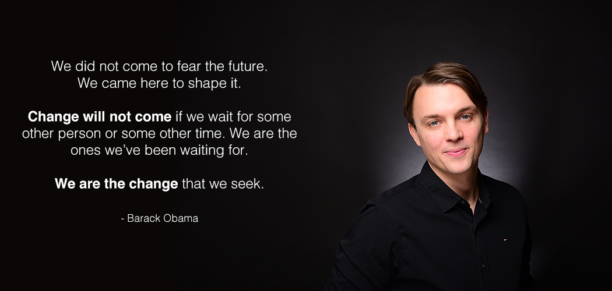

💬 Hello there. I am Gui. I am on my second decade as a software engineer. The last decade was incredibly exciting. I scratched the surface of this immense and always evolving area that is software development, mastering various languages and the different approaches to run your code, towards the last half of the first decade I went deeper into the cloud and developer operations.

🔭 I hope to explore the next decade using all the knowledge that I accumulated to thrive on a personal business project (or at least have fun failing 😄) and continue to learn new skills and exchange knowledge with different people in different fields.